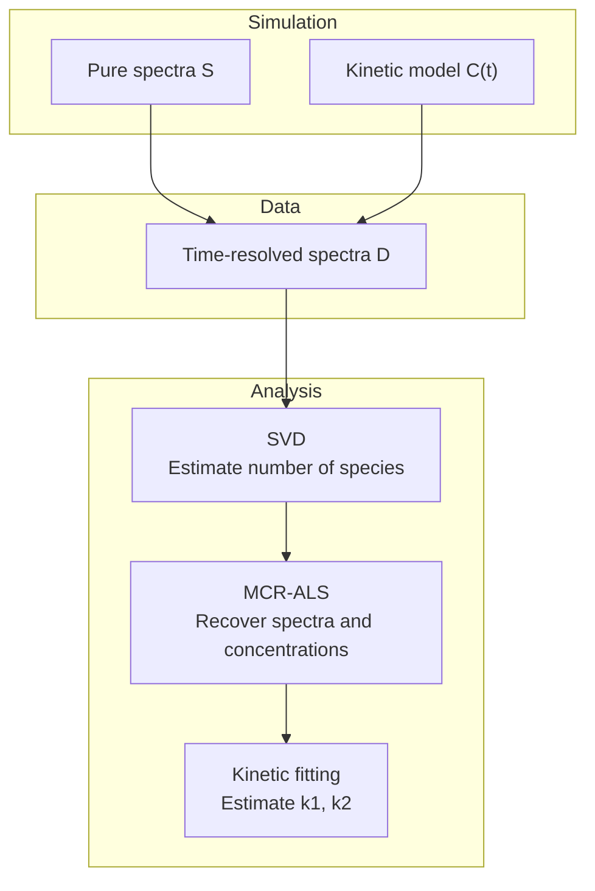

# Multivariate Analysis of Time-Resolved NMR Spectra

## An SVD and MCR-ALS workflow for kinetic analysis

This tutorial demonstrates how **Singular Value Decomposition (SVD)** and **Multivariate Curve Resolution – Alternating Least Squares (MCR-ALS)** can be used to analyze time-resolved NMR spectra and extract:

* the number of chemical species present
* their pure spectra
* their concentration profiles
* the kinetic constants governing the reaction

Small deviations are expected due to added noise, numerical uncertainty in the MCR decomposition, and reduced sensitivity of some components to specific rate constants.

The workflow is demonstrated using synthetic NMR data, allowing the recovered results to be compared with the known ground truth.

The tutorial includes both 1D spectra and 2D HSQC-like spectra, showing how the same bilinear analysis framework can be applied to different types of spectroscopic data.

## Workflow



## Conceptual overview

Time-resolved spectroscopic experiments can often be described using a bilinear mixture model:

$D = C S^{T}$

where:

* D: measured data matrix (time × spectral variables)
* C: concentration profiles of the chemical species over time (time × components)
* S: pure component spectra (variables × components)

The analysis workflow follows three main steps:

**1. Data simulation**

Synthetic spectra are generated for three species involved in a sequential reaction:

*Holo* → *Intermediate* → *Apo*

**2. SVD analysis**

Singular Value Decomposition is used to estimate the number of independent spectral components present in the data.

**3. MCR-ALS decomposition**

The dataset is decomposed into estimated spectra and concentration profiles, which are then used for kinetic analysis.


## 1D vs 2D data

For 1D spectra, the dataset is naturally arranged as a matrix:

$D \in \mathbb{R}^{n_{time} \times n_{variables}}$

For 2D spectra, each spectrum is a matrix:

$𝑆_{𝑘} ∈ \mathbb{R}^{𝑛_{𝑁}×𝑛_{𝐻}}$

Before applying SVD or MCR-ALS, each spectrum is vectorized:

$\mathbf{s}_k = \mathrm{vec}\!\left(S_k^{(2D)}\right) \in \mathbb{R}^{n_N \cdot n_H}$

This produces a two-way matrix:

$D \in \mathbb{R}^{n_{time} \times (n_N \cdot n_H)}$

After the analysis, the recovered spectra can be reshaped back into 2D form.


## Requirements

## Installation

Clone the repository and install the dependencies:

```bash
git clone https://github.com/luisinadin/Multivariate_Analysis_Time-Resolved_NMR
cd <repo>
pip install -r requirements.txt
```